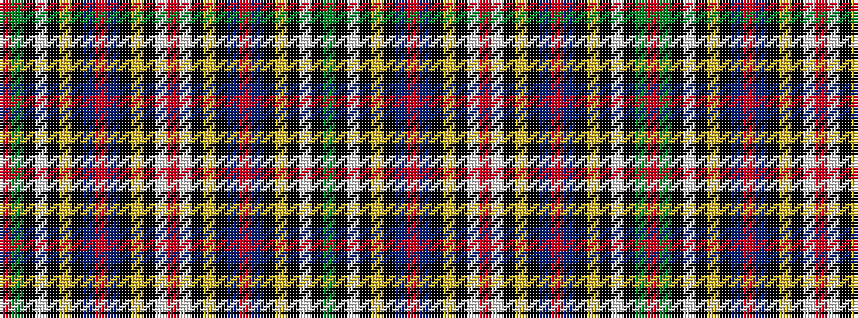

GKWKYKBRBKYKWRWKYKBRBKYKWKGR

It is a 28 stripe tartan.

<figure class="pat-woven">

<figcaption>idealised sample</figcaption>
</figure>

## Colour Sequence



## Tartans with this colour sequence

| Tartans |
|---------------|
| [Wilson's No.017](/setts/s28/r44g25k2w6k2ly3k16t12r6t12k16ly3k2w6r44w6k2ly3k16t12r6t12k16ly3k2w6k2g22~x2/)|
||
