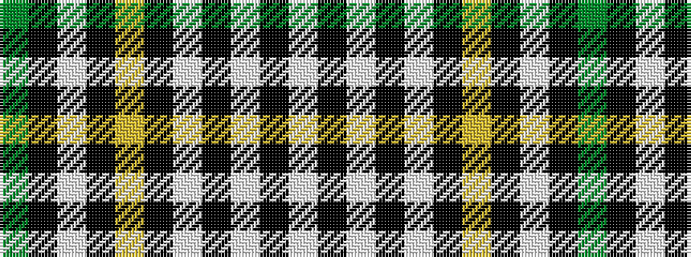

GKWKYKWKWKW

It is a 11 stripe tartan.

<figure class="pat-woven">

<figcaption>idealised sample</figcaption>
</figure>

## Colour Sequence



## Tartans with this colour sequence

| Tartans |
|---------------|
| [Dalgliesh Dress](/setts/s11/g10k10lb4k2ly2k2lb3k12lb12k2lb3~x2/)|
||
