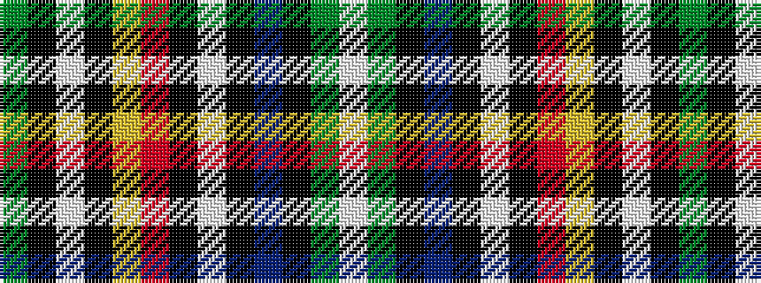

GKWKYRKWKBKGW

It is a 13 stripe tartan.

<figure class="pat-woven">

<figcaption>idealised sample</figcaption>
</figure>

## Colour Sequence



## Tartans with this colour sequence

| Tartans |
|---------------|
| [Abbotsford, City of](/setts/s13/g50k3w4k1lo5r4k1w2k2t15k5g4w2~x2/)|
||
| [City of Abbotsford (District)](/setts/s13/dg50k3w4k1lo5r4k1w2k2b15k5dg4w2~x2/)|
||
