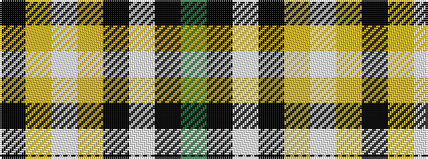

GKWKYWYK

It is a 8 stripe tartan.

<figure class="pat-woven">

<figcaption>idealised sample</figcaption>
</figure>

## Colour Sequence



## Tartans with this colour sequence

| Tartans |
|---------------|
| [Entrepreneurial Spark](/variants/s8/k14lo3w8lo4k6w9k31g1~x2/)|
||
