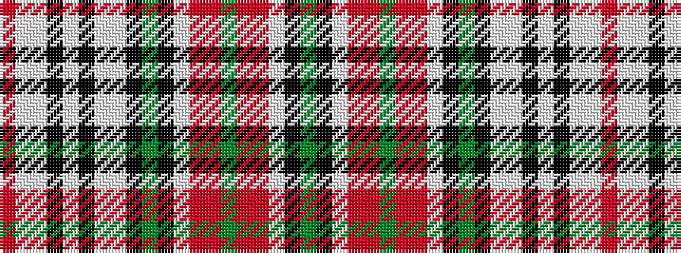

GKWRRGRRWKGKWWKWKWWR

It is a 20 stripe tartan.

<figure class="pat-woven">

<figcaption>idealised sample</figcaption>
</figure>

## Colour Sequence



## Tartans with this colour sequence

| Tartans |
|---------------|
| [MacBain](/variants/s20/r60lb2lbi5k2lb2k2lbi5lb2k2dg12k2lbi2r5ri5dg2ri5r5lbi2k2dg6/)|
||
