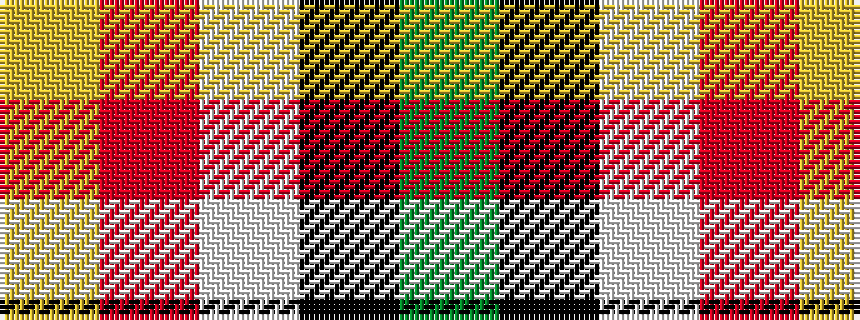

GKWRY

It is a 5 stripe tartan.

<figure class="pat-woven">

<figcaption>idealised sample</figcaption>
</figure>

## Colour Sequence



## Tartans with this colour sequence

| Tartans |
|---------------|
| [Oakley (2015)](/variants/s5/dg37k22w4r15lo3~x2/)|
||
| [Oakley (2015)](/variants/s5/dg37k22w4r15ly3~x2/)|
||
