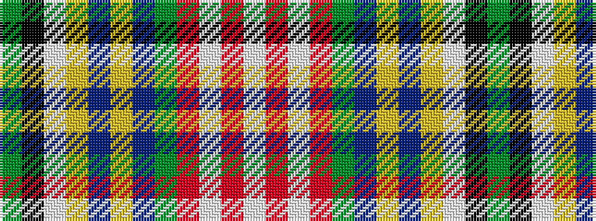

GKWYBYBGRWRW

It is a 12 stripe tartan.

<figure class="pat-woven">

<figcaption>idealised sample</figcaption>
</figure>

## Colour Sequence



## Tartans with this colour sequence

| Tartans |
|---------------|
| [Seller (Personal)](/variants/s12/dy63k4lb9ly2db4ly2db4dy11r8lb2r4w5~x2/)|
||
