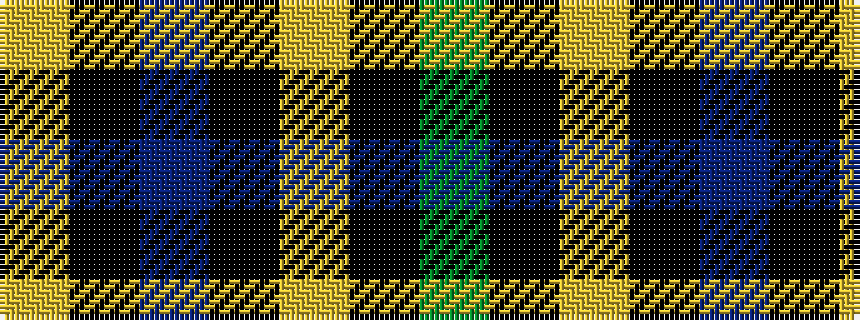

GKYKBKY

It is a 7 stripe tartan.

<figure class="pat-woven">

<figcaption>idealised sample</figcaption>
</figure>

## Colour Sequence



## Tartans with this colour sequence

| Tartans |
|---------------|
| [Alberta](/setts/s7/g18k2lr2k2t3k2ly6~x4/)|
||
