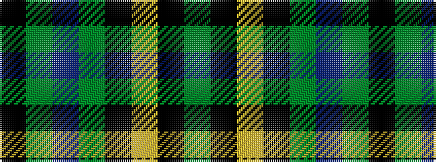

GKYKGBGK

It is a 8 stripe tartan.

<figure class="pat-woven">

<figcaption>idealised sample</figcaption>
</figure>

## Colour Sequence



## Tartans with this colour sequence

| Tartans |
|---------------|
| [Harley (Leslie), Robert](/setts/s8/dg2k3ly1k3dg2db8dg16k1~x4/)|
||
| [Harley (Leslie), Robert](/setts/s8/g2k3ly1k3g2db8g16k1~x4/)|
||
