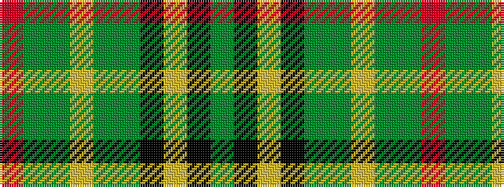

GKYKGGYGGR

It is a 10 stripe tartan.

<figure class="pat-woven">

<figcaption>idealised sample</figcaption>
</figure>

## Colour Sequence



## Tartans with this colour sequence

| Tartans |
|---------------|
| [Grenauld](/variants/s10/dg36k52lo2k8dg8dy8lo2dy6dg36r1~x2/)|
||
