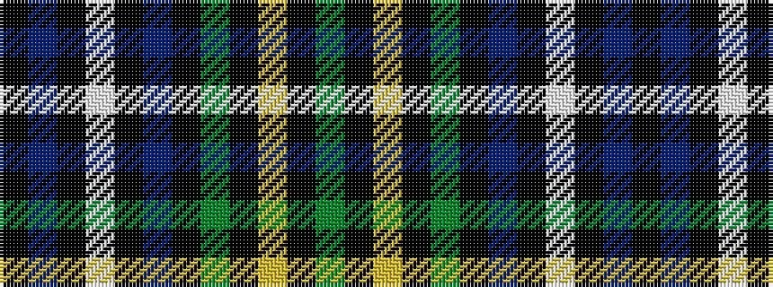

GKYKGKBKWKBK

It is a 12 stripe tartan.

<figure class="pat-woven">

<figcaption>idealised sample</figcaption>
</figure>

## Colour Sequence



## Tartans with this colour sequence

| Tartans |
|---------------|
| [Unidentified #32](/variants/s12/k8dp1k1w1k2dp8k8dg8k1ly1k2dg8~x2/)|
||
| [Unnamed 10](/variants/s12/k8p1k1w1k2p8k8g8k1ly1k2g8~x2/)|
||
