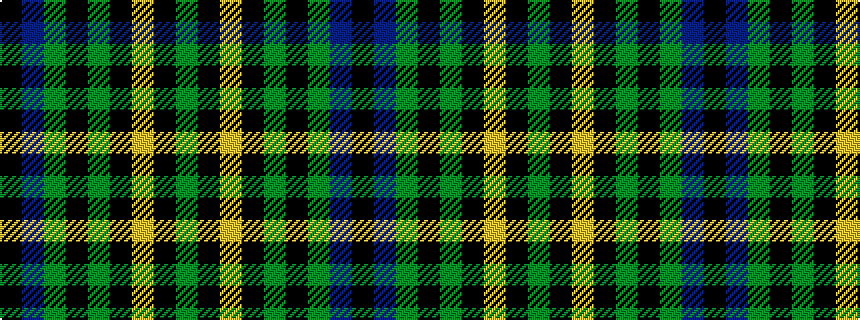

GKYKGKGBK

It is a 9 stripe tartan.

<figure class="pat-woven">

<figcaption>idealised sample</figcaption>
</figure>

## Colour Sequence



## Tartans with this colour sequence

| Tartans |
|---------------|
| [Madras 3 (Fashion)](/variants/s9/k6db49g10k2g10k2lo26k2g2~x2/)|
||
