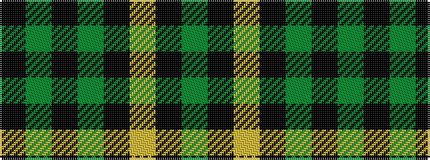

GKYKGKGK

It is a 8 stripe tartan.

<figure class="pat-woven">

<figcaption>idealised sample</figcaption>
</figure>

## Colour Sequence



## Tartans with this colour sequence

| Tartans |
|---------------|
| [MacLean VS](/setts/s8/dg3k6lr1k6dg2k2dg16k1~x2/)|
||
