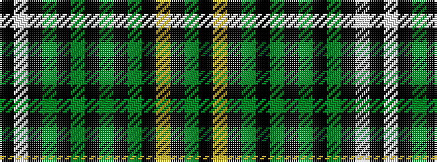

GKYKGKGKGKGKWK

It is a 14 stripe tartan.

<figure class="pat-woven">

<figcaption>idealised sample</figcaption>
</figure>

## Colour Sequence



## Tartans with this colour sequence

| Tartans |
|---------------|
| [MacAlpine](/setts/s14/k4lb1k4dg1k1dg6k1dg6k1dg1k4ly1k4dg1~x2/)|
||
