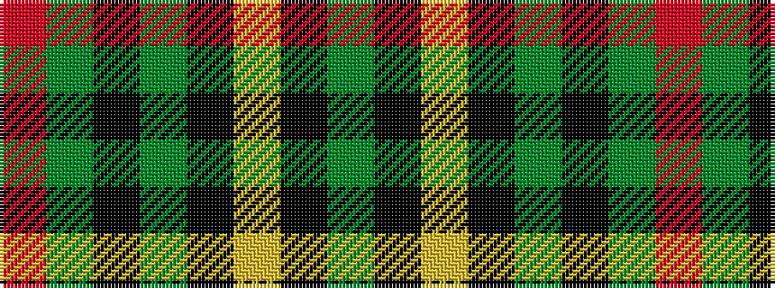

GKYKGKGR

It is a 8 stripe tartan.

<figure class="pat-woven">

<figcaption>idealised sample</figcaption>
</figure>

## Colour Sequence



## Tartans with this colour sequence

| Tartans |
|---------------|
| [MacAulay Hunting](/setts/s8/dg6k16lr1k16dg8k4dg12r2~x2/)|
||
