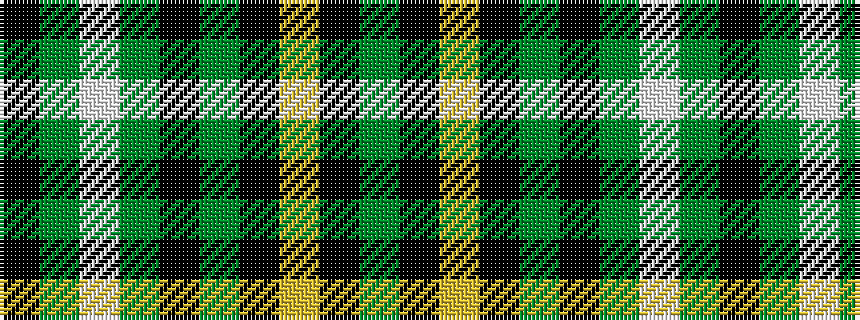

GKYKGKGWGK

It is a 10 stripe tartan.

<figure class="pat-woven">

<figcaption>idealised sample</figcaption>
</figure>

## Colour Sequence



## Tartans with this colour sequence

| Tartans |
|---------------|
| [Smeaton Hunting (Name)](/setts/s10/k6g4lb3g44k32g3k3lo3k2g3~x2/)|
||
