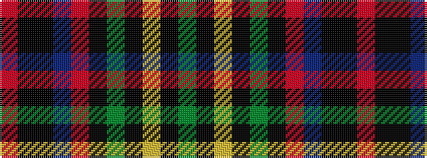

GKYKGKRBKKR

It is a 11 stripe tartan.

<figure class="pat-woven">

<figcaption>idealised sample</figcaption>
</figure>

## Colour Sequence



## Tartans with this colour sequence

| Tartans |
|---------------|
| [Marsa Scout Group](/setts/s11/r4k1k1db8r2k44g8k1ly2k1g4~x2/)|
||
