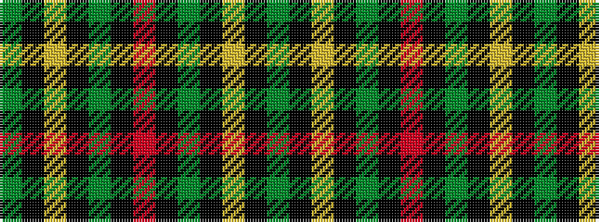

GKYKGKRKGKYKG

It is a 13 stripe tartan.

<figure class="pat-woven">

<figcaption>idealised sample</figcaption>
</figure>

## Colour Sequence



## Tartans with this colour sequence

| Tartans |
|---------------|
| [Hilton Check](/setts/s13/dg25k1lr2k1dg4k1r2k1dg4k1ly2k1dg25~x4/)|
||
