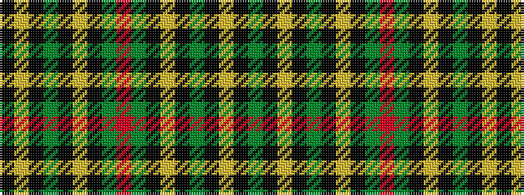

GKYKGKYKGRGKYKGKYK

It is a 18 stripe tartan.

<figure class="pat-woven">

<figcaption>idealised sample</figcaption>
</figure>

## Colour Sequence



## Tartans with this colour sequence

| Tartans |
|---------------|
| [Harbor Club](/variants/s18/r47g14k5ly2k3g7k3ly2k5g14~x2/)|
||
