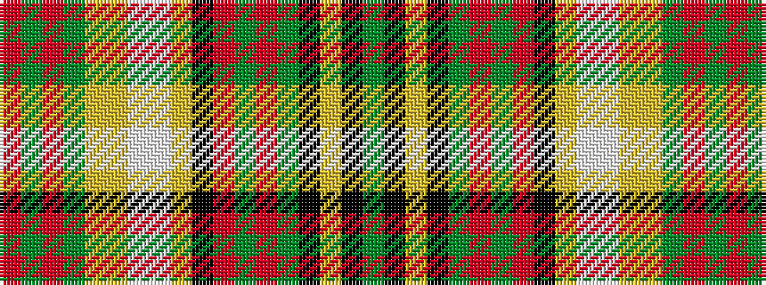

GKYKGRGRKYWWYYGRGR

It is a 18 stripe tartan.

<figure class="pat-woven">

<figcaption>idealised sample</figcaption>
</figure>

## Colour Sequence



## Tartans with this colour sequence

| Tartans |
|---------------|
| [Bear](/setts/s18/dy24k1lr2k1dy24o2dy2o12k4lr4w4w4ly4lo4dy4o12dy2o2~x2/)|
||
