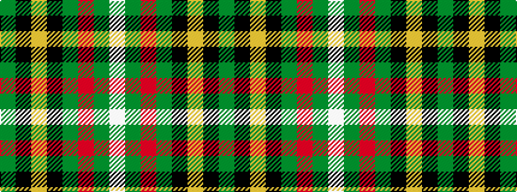

GKYKGRGW

It is a 8 stripe tartan.

<figure class="pat-woven">

<figcaption>idealised sample</figcaption>
</figure>

## Colour Sequence



## Tartans with this colour sequence

| Tartans |
|---------------|
| [O'Neill (Name)](/variants/s8/w6g5r5g45k4lo24k4g5~x2/)|
||
