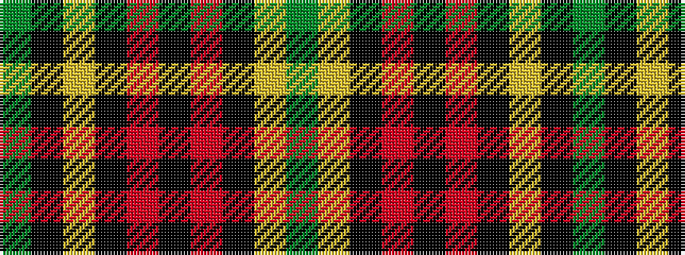

GKYKRKRKYG

It is a 10 stripe tartan.

<figure class="pat-woven">

<figcaption>idealised sample</figcaption>
</figure>

## Colour Sequence



## Tartans with this colour sequence

| Tartans |
|---------------|
| [Forde](/variants/s10/g30ly2k3r2k2r2k3ly2k2g4~x2/)|
||
| [Forde Irish Family Tartan](/variants/s10/g16ly1k2r1k1r1k2ly1k1g1~x4/)|
||
