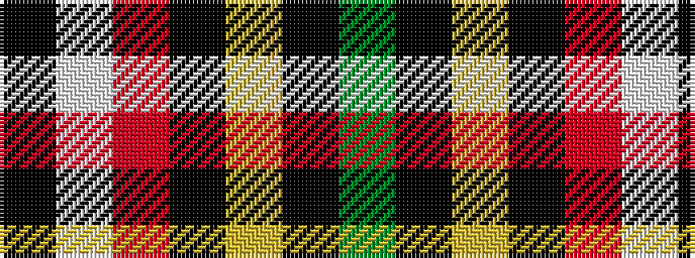

GKYKRWK

It is a 7 stripe tartan.

<figure class="pat-woven">

<figcaption>idealised sample</figcaption>
</figure>

## Colour Sequence



## Tartans with this colour sequence

| Tartans |
|---------------|
| [Gourlay, George (Personal)](/setts/s7/k24w1r6k21lo2k24dg1~x2/)|
||
| [Gourlay, George (Personal)](/setts/s7/k24w1r6k21lo2k24g1~x2/)|
||
