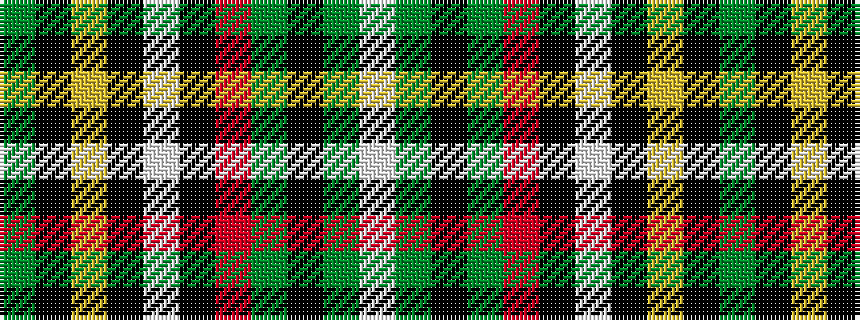

GKYKWKRGKGW

It is a 11 stripe tartan.

<figure class="pat-woven">

<figcaption>idealised sample</figcaption>
</figure>

## Colour Sequence



## Tartans with this colour sequence

| Tartans |
|---------------|
| [Cavalier, Green..](/setts/s11/y45k10ly2k2w2k2r10y5k1y5w1~x2/)|
||
