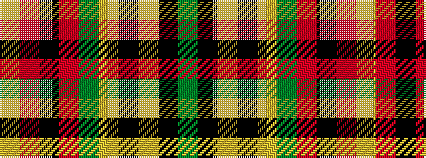

GKYKYGRKRY

It is a 10 stripe tartan.

<figure class="pat-woven">

<figcaption>idealised sample</figcaption>
</figure>

## Colour Sequence



## Tartans with this colour sequence

| Tartans |
|---------------|
| [Anthony Plaid Stewart](/variants/s10/dg18k1ly3k1lr1dg1r2k2r2lr2~x4/)|
||
