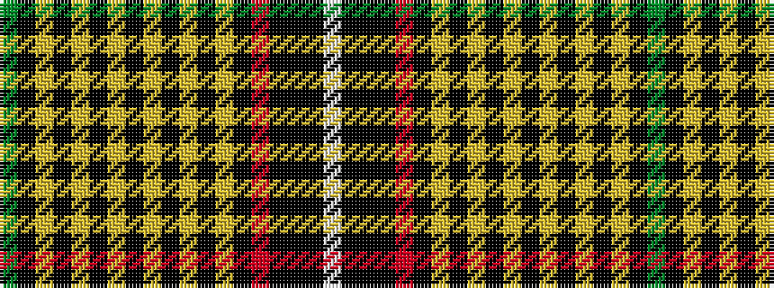

GKYKYKYKYKYKYKRKKKW

It is a 19 stripe tartan.

<figure class="pat-woven">

<figcaption>idealised sample</figcaption>
</figure>

## Colour Sequence



## Tartans with this colour sequence

| Tartans |
|---------------|
| [Ghana](/setts/s19/dg16k1lo8k2lo1k2lo1k4lo1k2lo1k2lo8k1r16k1k12k1w4~x2/)|
||
