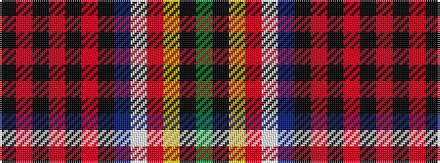

GKYRWBKRKRKRK

It is a 13 stripe tartan.

<figure class="pat-woven">

<figcaption>idealised sample</figcaption>
</figure>

## Colour Sequence



## Tartans with this colour sequence

| Tartans |
|---------------|
| [Norwich No.158](/setts/s13/g8k1ly1r1w1db8k1r4k1r4k1r4k1~x2/)|
||
