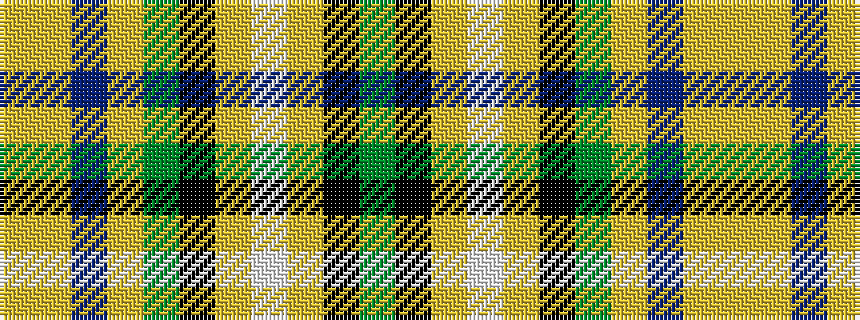

GKYWYKGYBYY

It is a 11 stripe tartan.

<figure class="pat-woven">

<figcaption>idealised sample</figcaption>
</figure>

## Colour Sequence



## Tartans with this colour sequence

| Tartans |
|---------------|
| [Roscommon County Crest (Fashion)](/setts/s11/g11k5lo7w5lo7k5g7lo11db16lo7ly5~x2/)|
||
