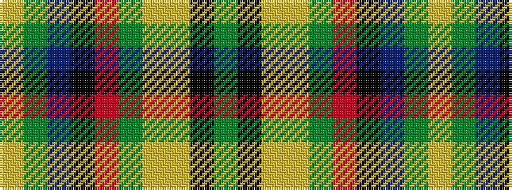

GKYYGRKBGY

It is a 10 stripe tartan.

<figure class="pat-woven">

<figcaption>idealised sample</figcaption>
</figure>

## Colour Sequence



## Tartans with this colour sequence

| Tartans |
|---------------|
| [State Seal of Maine (Fashion)](/setts/s10/dg49k8lo20lo3dg23r6k5t3dg10lo10~x2/)|
||
