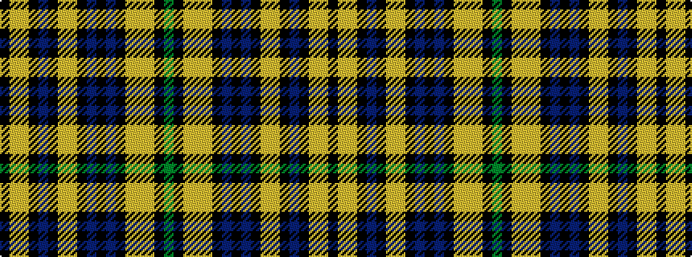

GKYYYKBKBKYYKBKYYK

It is a 18 stripe tartan.

<figure class="pat-woven">

<figcaption>idealised sample</figcaption>
</figure>

## Colour Sequence



## Tartans with this colour sequence

| Tartans |
|---------------|
| [Raznotravie (Corporate)](/variants/s18/k10ly1lyi2k1n2k1lyi2ly1k1n2k3n1k17lyi18ly1lyi2k1dg2~x2/)|
||
