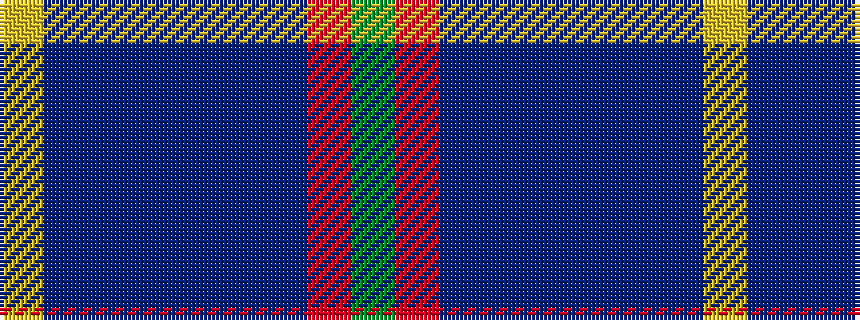

GRBBBBBBY

It is a 9 stripe tartan.

<figure class="pat-woven">

<figcaption>idealised sample</figcaption>
</figure>

## Colour Sequence



## Tartans with this colour sequence

| Tartans |
|---------------|
| [Rose VS](/setts/s9/dg4r32n9dr6n2dr3n2dr12lr3~x2/)|
||
| [Rose VS](/setts/s9/dg4r32n9dr6n2dr3n2dr12lr3/)|
||
