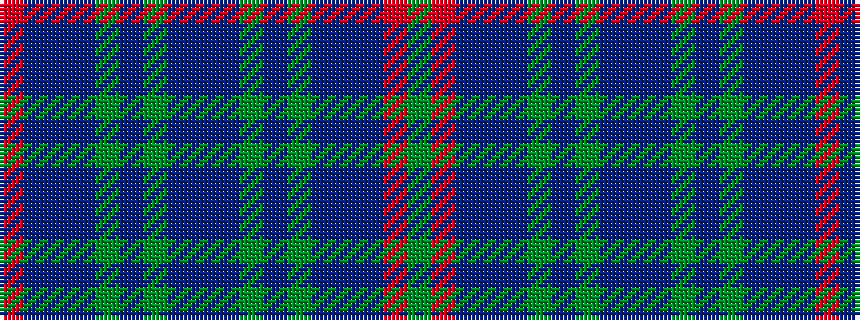

GRBBBGBGBBBGBGBBBR

It is a 18 stripe tartan.

<figure class="pat-woven">

<figcaption>idealised sample</figcaption>
</figure>

## Colour Sequence



## Tartans with this colour sequence

| Tartans |
|---------------|
| [Buchanan Variation (Fashion)](/setts/s18/r7do1do3do1dg4do3dg4do1do4do1dg4do1dg4do1do4do1r7dg1~x4/)|
||
