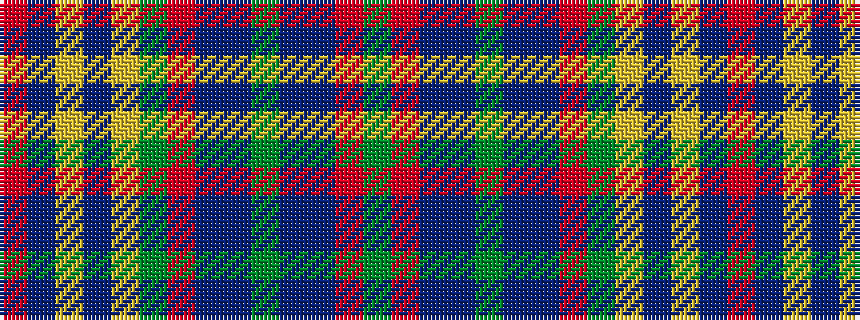

GRBBGBBRGYBYBR

It is a 14 stripe tartan.

<figure class="pat-woven">

<figcaption>idealised sample</figcaption>
</figure>

## Colour Sequence



## Tartans with this colour sequence

| Tartans |
|---------------|
| [Westmeath (District)](/setts/s14/g11r6dt6do2g3do2dt6r6g36lo2do3lo2dt5r5~x2/)|
||
