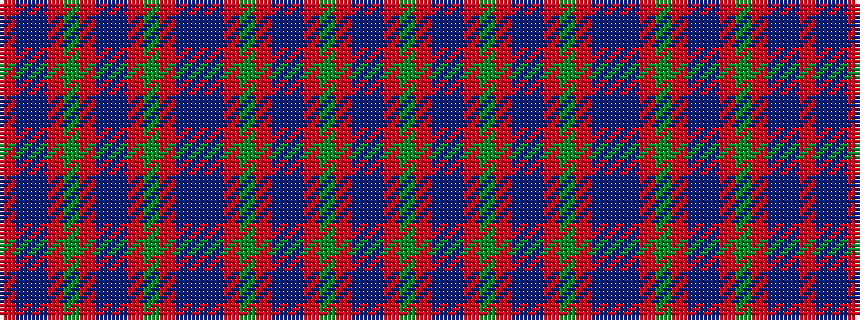

GRBBRGRBBRGRBBBRGRBBRGRBBR

It is a 26 stripe tartan.

<figure class="pat-woven">

<figcaption>idealised sample</figcaption>
</figure>

## Colour Sequence



## Tartans with this colour sequence

| Tartans |
|---------------|
| [Norwich No.023](/setts/s26/db2t1r2g16r2db6t1r2g6r2db16t1r2g2~x2/)|
||
