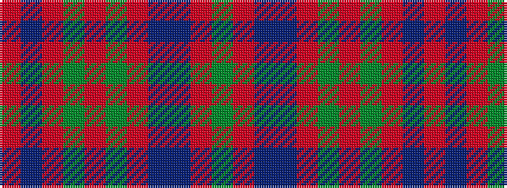

GRBBRGRGRBR

It is a 11 stripe tartan.

<figure class="pat-woven">

<figcaption>idealised sample</figcaption>
</figure>

## Colour Sequence



## Tartans with this colour sequence

| Tartans |
|---------------|
| [Hebridean 3](/variants/s11/g10r25t2db25r2g2r25g2r2db25r4~x2/)|
||
