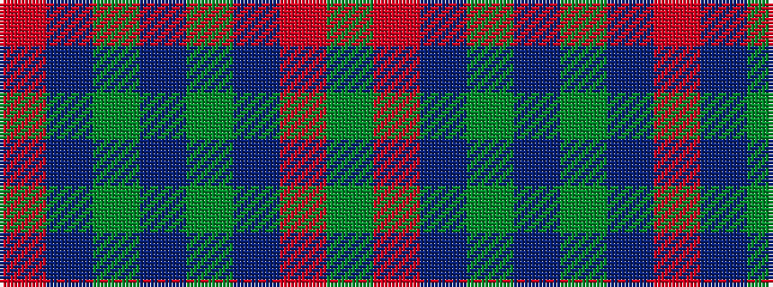

GRBGBGBR

It is a 8 stripe tartan.

<figure class="pat-woven">

<figcaption>idealised sample</figcaption>
</figure>

## Colour Sequence



## Tartans with this colour sequence

| Tartans |
|---------------|
| [Thomas of Wales](/setts/s8/r2db1g2db1g19db2r27g2~x2/)|
||
