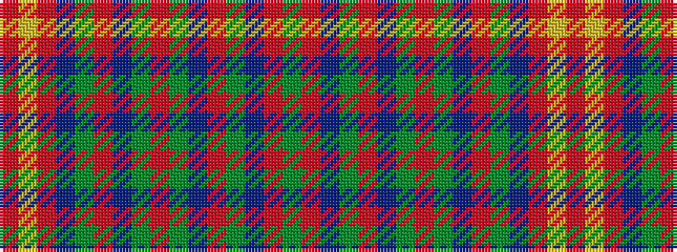

GRBGRBGRGBRGBRYR

It is a 16 stripe tartan.

<figure class="pat-woven">

<figcaption>idealised sample</figcaption>
</figure>

## Colour Sequence



## Tartans with this colour sequence

| Tartans |
|---------------|
| [Gudbrandsdalen of Mannsdrakt](/setts/s16/dg44r3do6dg6r2do1dg2r10dg2do1r2dg6do6r3lr1r42~x4/)|
||
