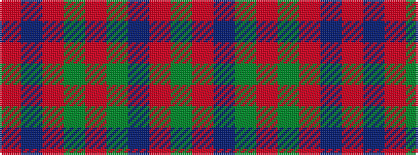

GRBGRGRBR

It is a 9 stripe tartan.

<figure class="pat-woven">

<figcaption>idealised sample</figcaption>
</figure>

## Colour Sequence



## Tartans with this colour sequence

| Tartans |
|---------------|
| [Baronage](/variants/s9/dg3r9t1dg9r1dg1r8db9r1~x4/)|
||
| [Convention of the Baronage (Corp)](/variants/s9/g3r9t1g9r1g1r9db9r1~x4/)|
||
