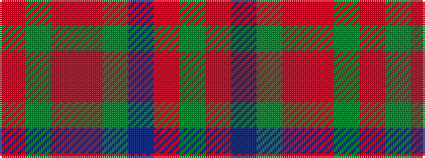

GRBGRRGR

It is a 8 stripe tartan.

<figure class="pat-woven">

<figcaption>idealised sample</figcaption>
</figure>

## Colour Sequence



## Tartans with this colour sequence

| Tartans |
|---------------|
| [Rannoch Moor (Fashion)](/variants/s8/r3dg12r12r5dg2db30r2dg2~x2/)|
||
