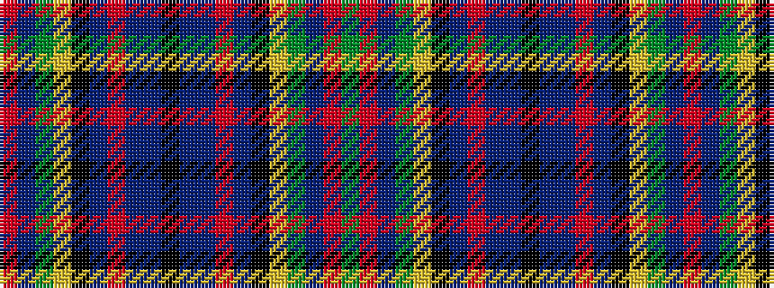

GRBGYKBRBBKBBRBKYGBR

It is a 20 stripe tartan.

<figure class="pat-woven">

<figcaption>idealised sample</figcaption>
</figure>

## Colour Sequence



## Tartans with this colour sequence

| Tartans |
|---------------|
| [Stinson](/setts/s20/k7b20t2r6t2k20ly3g20b27r3g6~x2/)|
||
