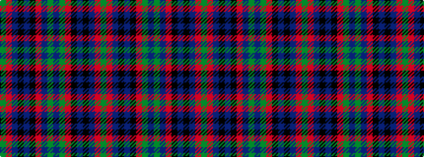

GRBKBKRBGBGRKBKBRG

It is a 18 stripe tartan.

<figure class="pat-woven">

<figcaption>idealised sample</figcaption>
</figure>

## Colour Sequence



## Tartans with this colour sequence

| Tartans |
|---------------|
| [Fiddes](/variants/s18/g12r11p12k1p1k1r32g8p8g8p8r32k1p1k1p12r11g12~x2/)|
||
| [Fiddes #3](/variants/s18/g12r11dp12k1dp1k1r32dp8g8dp8g8r32k1dp1k1dp12r11g12~x2/)|
||
