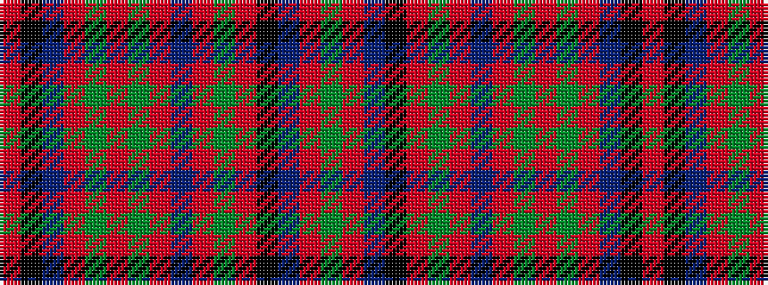

GRBKRGRBRGRGRBKR

It is a 16 stripe tartan.

<figure class="pat-woven">

<figcaption>idealised sample</figcaption>
</figure>

## Colour Sequence



## Tartans with this colour sequence

| Tartans |
|---------------|
| [Stewart of Appin 3](/variants/s16/r3k2t2r2g19r3g2r2db6r2g2r21k2t2r2g2~x2/)|
||
| [Stuart/Stewart of Appin #3](/variants/s16/r3k2t2r2dg19r3dg2r2db6r2dg2r21k2t2r2dg2~x2/)|
||
