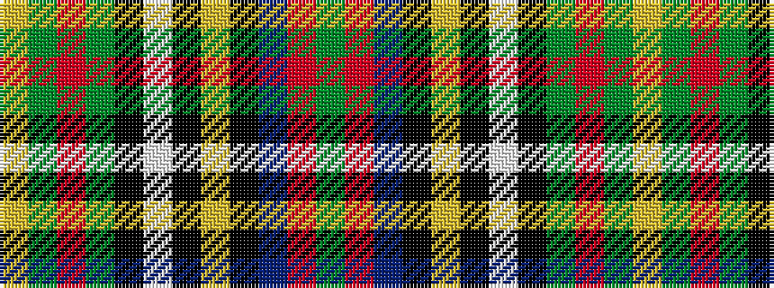

GRBKYKWKGRGY

It is a 12 stripe tartan.

<figure class="pat-woven">

<figcaption>idealised sample</figcaption>
</figure>

## Colour Sequence



## Tartans with this colour sequence

| Tartans |
|---------------|
| [Stewart of Galloway Clan Tartan Tartan Number: 851. Earliest known date: c.1820 Count taken from the specimen at the Smith Institute in Stirling. See products available Copyright © Blair Urquhart, Comrie, 2015](/setts/s12/g9r52t13k16ly2k3w4k3g23r15g7ly3~x2/)|
||
