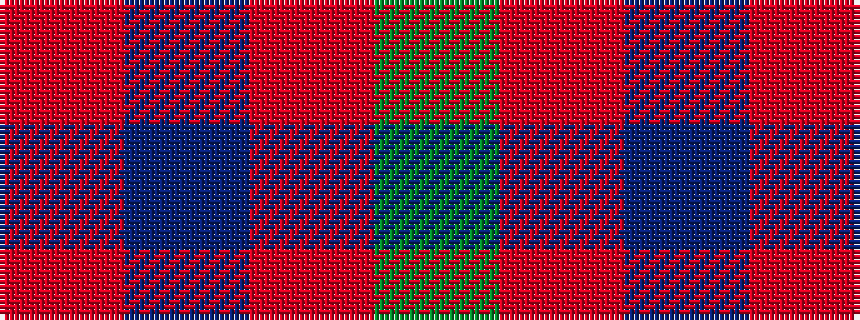

GRBR

It is a 4 stripe tartan.

<figure class="pat-woven">

<figcaption>idealised sample</figcaption>
</figure>

## Colour Sequence



## Tartans with this colour sequence

| Tartans |
|---------------|
| [Coleman, Sarah-Louise (Personal)](/setts/s4/dp3o1g2~x10/)|
||
| [Wilson's No.062](/setts/s4/db13r2g13~x2/)|
||
