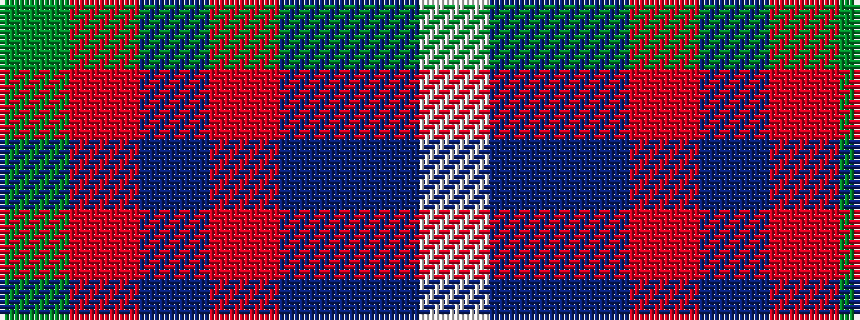

GRBRBBW

It is a 7 stripe tartan.

<figure class="pat-woven">

<figcaption>idealised sample</figcaption>
</figure>

## Colour Sequence



## Tartans with this colour sequence

| Tartans |
|---------------|
| [MacCord (Personal)](/setts/s7/dg6r2db1r3db16n20w2~x2/)|
||
