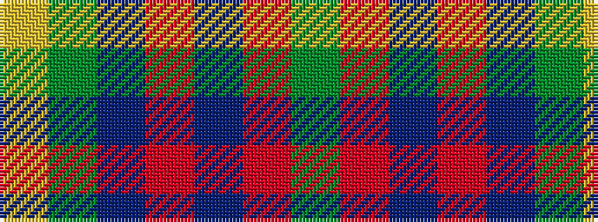

GRBRBGY

It is a 7 stripe tartan.

<figure class="pat-woven">

<figcaption>idealised sample</figcaption>
</figure>

## Colour Sequence



## Tartans with this colour sequence

| Tartans |
|---------------|
| [Feis An Eilein](/variants/s7/y2r9db8m4db8dg2ly2~x8/)|
||
