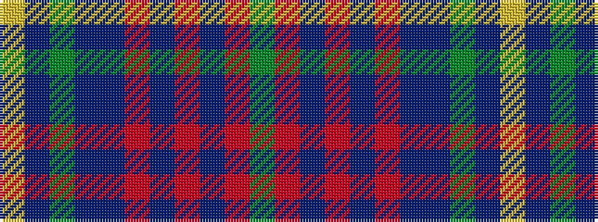

GRBRBRBBGBY

It is a 11 stripe tartan.

<figure class="pat-woven">

<figcaption>idealised sample</figcaption>
</figure>

## Colour Sequence



## Tartans with this colour sequence

| Tartans |
|---------------|
| [NHK Asaichi](/setts/s11/dy2r11db1r1db1r1db4db6dy1db1ly1~x4/)|
||
