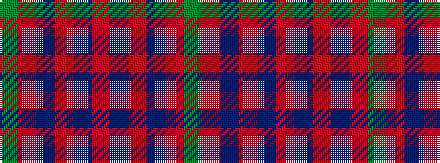

GRBRBRBRBRG

It is a 11 stripe tartan.

<figure class="pat-woven">

<figcaption>idealised sample</figcaption>
</figure>

## Colour Sequence



## Tartans with this colour sequence

| Tartans |
|---------------|
| [Hughes (Welsh Name)](/setts/s11/g4r34dt20r4dt8r6db2r5dt2r3g4/)|
||
