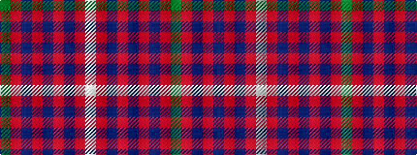

GRBRBRBRW

It is a 9 stripe tartan.

<figure class="pat-woven">

<figcaption>idealised sample</figcaption>
</figure>

## Colour Sequence



## Tartans with this colour sequence

| Tartans |
|---------------|
| [Rose](/setts/s9/dg2r28db6r5db2r2db2r11lb2/)|
||
| [Rose](/setts/s9/g4r32db9r6db2r3db2r12w3~x2/)|
||
