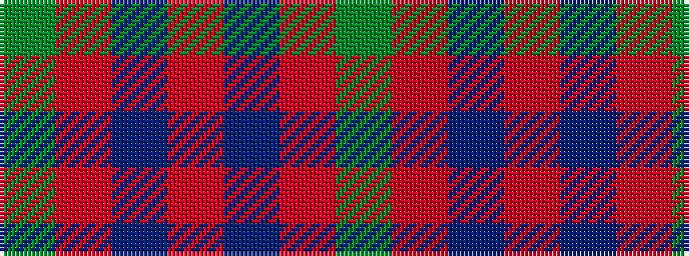

GRBRBRG

It is a 7 stripe tartan.

<figure class="pat-woven">

<figcaption>idealised sample</figcaption>
</figure>

## Colour Sequence



## Tartans with this colour sequence

| Tartans |
|---------------|
| [Fraser, Isabella](/setts/s7/g2r21db60r48db2r3g2~x2/)|
||
